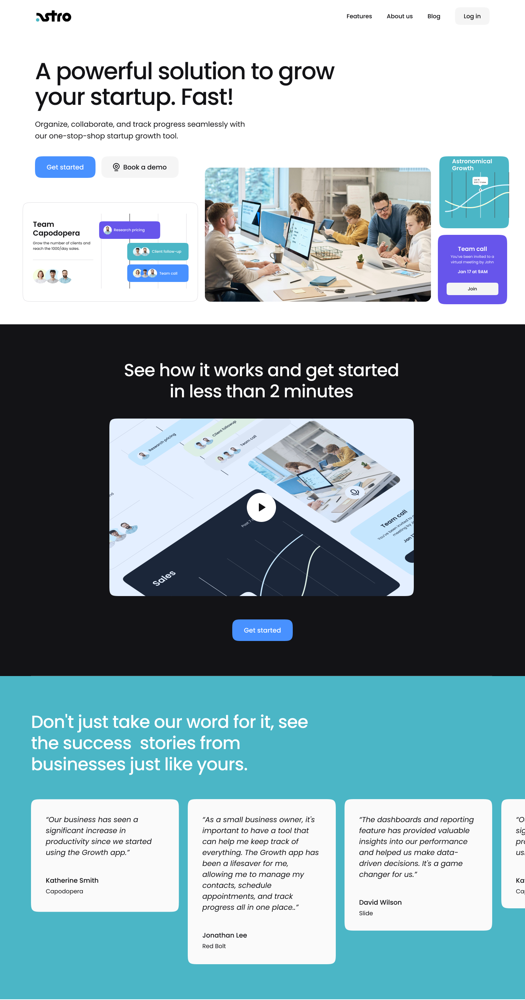

# SaaS Astro Landing Page

This is a landing page I made for a made up company called Astro. It is built with pure HTML and CSS and a bit of JavaScript for the hamburger menu and the FAQ accordion.

figma link of the design: https://www.figma.com/proto/WwZAYZcfNMwmxChYrquF9g/landing?type=design&node-id=17-541&t=1aaOxCfwmNZFxG6Q-0&scaling=min-zoom&page-id=0%3A1

# To Run Proyect 

<il>Download astro-landing-page file</il>
<il>Right click on index.html</il>
<il>Open in chrome</il>



## Steps to use Docker 

```shell
docker build -t saas-landing-page:1 .
```

```shell
docker run -d -p 80:80 saas-landing-page:1
```
